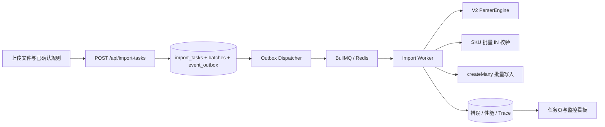

# V4 异步导入架构设计

上传请求和后台执行通过 `task_id` 解耦。任务、批次和 Outbox 在一个 PostgreSQL 事务内提交；Dispatcher 只有在 BullMQ 入队成功后才把事件标记为 `SENT`。未配置 Redis 的本地环境使用同一 Outbox 表作为任务队列。

默认 500 行一个处理单元，常驻 Worker 并发 4。每批复用 V2 `ParserEngine` 和规则 JSON，批量查询 SKU、批量查询外部编码、批量写入有效行，错误行逐条记录但不会阻断有效行。批次领取与进度累计均有状态条件，运单再由唯一 `dedupeKey` 防止重复消费。

可观测数据分为三层：任务累计进度、批次阶段耗时、行级错误/Trace 事件。`trace_id` 从上传、Outbox 事件信封、队列 Job、Worker 到数据库日志保持不变。
