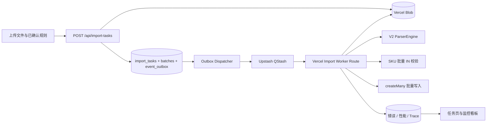

# V4 异步导入架构设计

浏览器先获取受限的 Blob 客户端上传凭证，把文件直接写入私有 Vercel Blob，再向任务 API 提交 Blob URL、文件名、行数和规则元数据；大文件不会穿过 Vercel Function 的请求体。上传请求和后台执行通过 `task_id` 解耦。任务、批次和 Outbox 在一个 PostgreSQL 事务内提交；Dispatcher 只有在 QStash 接受消息后才把事件标记为 `SENT`。消息只包含 `outboxId`，原始文件和解析快照保存在私有 Blob。未配置 QStash/Blob 的本地环境分别使用数据库队列和本地文件系统。

文件准备事件先由单个 Worker 复用 V2 `ParserEngine` 解析一次，并在私有 Blob 中生成默认 500 行一个的分片快照；随后创建批次 Outbox，QStash 对各分片 Worker 并发投递和失败重试。每个批次只下载自己的 500 行，批量查询 SKU、批量查询外部编码、批量写入有效行，错误行逐条记录但不会阻断有效行。批次领取与进度累计均有状态条件，运单再由唯一 `dedupeKey` 防止重复消费；超过锁超时的 `PROCESSING` 批次可重新领取。

可观测数据分为三层：任务累计进度、批次阶段耗时、行级错误/Trace 事件。`trace_id` 从上传、Outbox 事件信封、QStash 消息、Worker 到数据库日志保持不变。Vercel Hobby 每日 Cron 只作为 Outbox 恢复扫描，正常任务在上传响应后立即投递。
